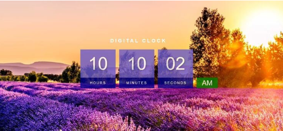

# ⏰ Digital Clock

## Description
A live digital clock that shows the current time in hours, minutes, and seconds.

## Features
- Displays real-time hours, minutes, and seconds
- Updates every second automatically
- AM/PM format toggle
- Responsive and clean UI

## Concepts Practiced
- Working with JavaScript `Date` object
- `setInterval` for real-time updates
- DOM manipulation
- Time formatting

## Bonus Challenge
Add different time zones or a stopwatch feature.

## Live Demo

<iframe src="https://codesandbox.io/embed/wzw6sw?view=preview"
     style="width:100%; height: 500px; border:0; border-radius: 4px; overflow:hidden;"
     title="interactive-drum-kit"
     allow="accelerometer; ambient-light-sensor; camera; encrypted-media; geolocation; gyroscope; hid; microphone; midi; payment; usb; vr; xr-spatial-tracking"
     sandbox="allow-forms allow-modals allow-popups allow-presentation allow-same-origin allow-scripts"
   ></iframe>
   

