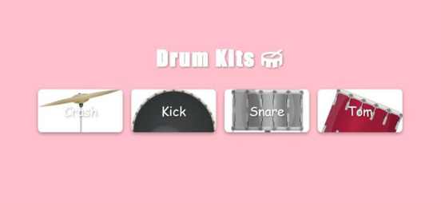

# 🥁 Drum Kits

## Description
Create a fun interactive drum kit that plays sounds when you click buttons or press keys.

## Features
- Play drum sounds on button click or key press
- Visual feedback with button animations
- Multiple drum sounds to play
- Responsive and engaging UI

## Concepts Practiced
- Event listeners for clicks and keyboard input
- Audio playback in JavaScript
- DOM manipulation and animations
- Handling multiple events efficiently

## Bonus Challenge
Add the ability to record and play back drum sequences.

## Live Demo

<iframe src="https://codesandbox.io/embed/s3yv7r?view=preview"
     style="width:100%; height: 500px; border:0; border-radius: 4px; overflow:hidden;"
     title="interactive-drum-kit"
     allow="accelerometer; ambient-light-sensor; camera; encrypted-media; geolocation; gyroscope; hid; microphone; midi; payment; usb; vr; xr-spatial-tracking"
     sandbox="allow-forms allow-modals allow-popups allow-presentation allow-same-origin allow-scripts"
   ></iframe>
   
