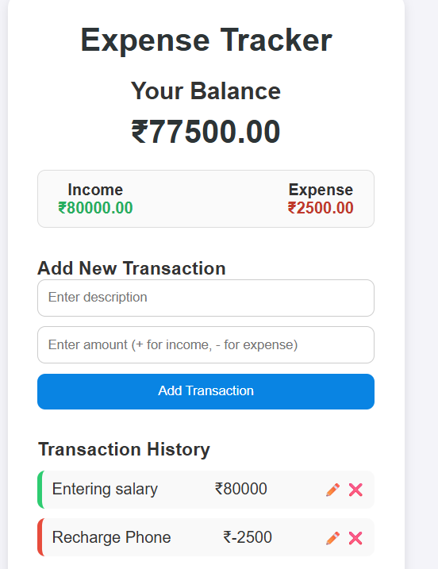

# 💰 Expense Tracker

## Description

A simple **Expense Tracker** built using **HTML, CSS, and JavaScript (ES Modules)** that allows users to manage their daily income and expenses. Users can **add, edit, and delete** transactions, view their **balance summary**, and store data locally using **localStorage** — all without a backend.

## Features

* Add new transactions (income or expense)
* Edit existing transactions
* Delete unwanted transactions
* View total balance, income, and expense summaries
* Persistent data storage using `localStorage`
* Clean and responsive UI design

## Concepts Practiced

* DOM manipulation
* Working with arrays and objects
* Event handling and form submission
* Data persistence using `localStorage`
* Conditional rendering and dynamic UI updates
* Modular JavaScript (`index.mjs`)

## Bonus Challenge

* Add a **dark mode toggle** in the navbar 🌙
* Show a **monthly expense chart** using a JS chart library
* Add a **filter/search** option for transactions
* Allow users to **export data** as CSV

## Live Demo
