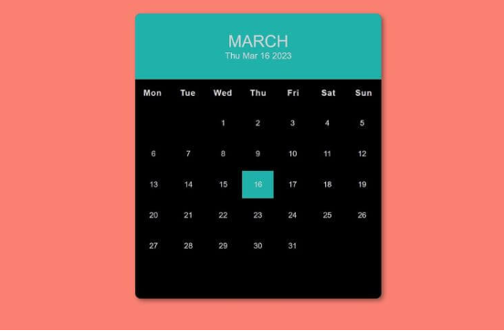

# 📅 Interactive Calendar

## Description
Build a simple interactive calendar that displays the days of a selected month and year. Users can navigate between months and visually track the current date.

## Features
- Displays all days for a selected month and year
- Highlights the current date
- Navigate between months and years
- Responsive and user-friendly layout

## Concepts Practiced
- Date and time manipulation using the JavaScript `Date` object
- DOM manipulation for dynamic calendar rendering
- Event handling for navigation controls
- Responsive design principles

## Bonus Challenge
Add the ability to mark important dates or events and display a tooltip or modal when a date is clicked.

## Live Demo

<iframe src="https://codesandbox.io/embed/ycj8q2?view=preview&hidenavigation=1"
     style="width:100%; height: 500px; border:0; border-radius: 4px; overflow:hidden;"
     title="interactive-calendar"
     allow="accelerometer; ambient-light-sensor; camera; encrypted-media; geolocation; gyroscope; hid; microphone; midi; payment; usb; vr; xr-spatial-tracking"
     sandbox="allow-forms allow-modals allow-popups allow-presentation allow-same-origin allow-scripts"
   ></iframe>

