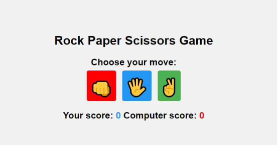

# ✊✋✌️ Rock Paper Scissors Game

## Description
Build a classic Rock Paper Scissors game where you play against the computer. Choose your move and see who wins!

## Features
- User can select Rock, Paper, or Scissors
- Computer randomly selects its move
- Shows the winner of each round
- Keeps track of the score

## Concepts Practiced
- Random number generation
- Conditional statements
- Event listeners
- DOM manipulation

## Bonus Challenge
Add animations and sound effects to make the game more interactive.

## Live Demo

  <iframe src="https://codesandbox.io/embed/7kjyv3?view=preview"
     style="width:100%; height: 500px; border:0; border-radius: 4px; overflow:hidden;"
     title="rock-paper-scissors"
     allow="accelerometer; ambient-light-sensor; camera; encrypted-media; geolocation; gyroscope; hid; microphone; midi; payment; usb; vr; xr-spatial-tracking"
     sandbox="allow-forms allow-modals allow-popups allow-presentation allow-same-origin allow-scripts"
   ></iframe>

