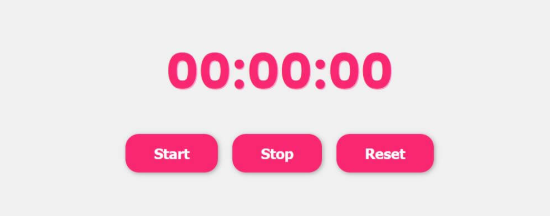

# ⏱️ Stopwatch

## Description
Create a simple stopwatch app that lets users start, stop, and reset a timer to track elapsed time.

## Features
- Start the timer
- Pause/Stop the timer
- Reset the timer to zero
- Displays time in minutes, seconds, and milliseconds

## Concepts Practiced
- Working with JavaScript `setInterval` and `clearInterval`
- DOM manipulation
- Event handling
- Time calculation and formatting

## Bonus Challenge
Add lap functionality to record and display multiple time splits.

## Live Demo

<iframe src="https://codesandbox.io/embed/yyhqfy?view=preview"
     style="width:100%; height: 500px; border:0; border-radius: 4px; overflow:hidden;"
     title="stopwatch-app"
     allow="accelerometer; ambient-light-sensor; camera; encrypted-media; geolocation; gyroscope; hid; microphone; midi; payment; usb; vr; xr-spatial-tracking"
     sandbox="allow-forms allow-modals allow-popups allow-presentation allow-same-origin allow-scripts"
   ></iframe>
   

