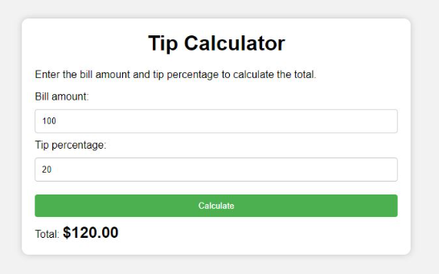

# 💸 Tip Calculator

## Description
Create a project where users can calculate tips based on a given bill amount and tip percentage.

## Features
- Input field for bill amount
- Buttons for selecting tip percentage (10%, 20%, 30%)
- Display of calculated tip and total amount

## Concepts Practiced
- Basic math operations
- DOM manipulation
- Event listeners
- Input validation

## Bonus Challenge
Add a “Split Bill” feature to divide the total between multiple people.

## Live Demo

<iframe src="https://codesandbox.io/embed/4fxhyc?view=preview&module=%2Findex.html"
     style="width:100%; height: 500px; border:0; border-radius: 4px; overflow:hidden;"
     title="tip-calculator"
     allow="accelerometer; ambient-light-sensor; camera; encrypted-media; geolocation; gyroscope; hid; microphone; midi; payment; usb; vr; xr-spatial-tracking"
     sandbox="allow-forms allow-modals allow-popups allow-presentation allow-same-origin allow-scripts"
></iframe>

