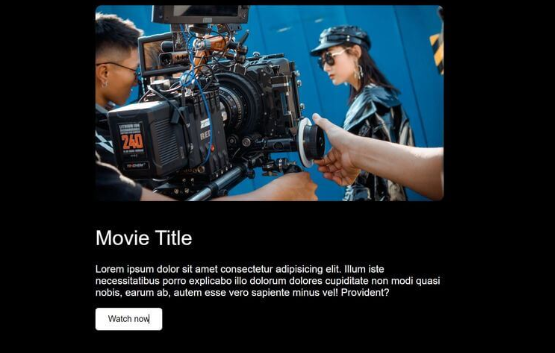

# 📽️ Video Trailer Popup

## Description
Create a popup modal that plays a video trailer when triggered. Perfect for movie or product previews!

## Features
- Click a button or image to open the video popup
- Video plays inside the popup modal
- Close button to stop video and close the popup
- Responsive design for all screen sizes

## Concepts Practiced
- Modal creation and toggling visibility
- Embedding and controlling HTML5 video
- Event handling for open/close actions
- CSS for overlays and animations

## Bonus Challenge
Add autoplay and pause video when popup is closed.

## Live Demo

  <iframe src="https://codesandbox.io/embed/zsvp9c?view=preview"
     style="width:100%; height: 500px; border:0; border-radius: 4px; overflow:hidden;"
     title="video popup"
     allow="accelerometer; ambient-light-sensor; camera; encrypted-media; geolocation; gyroscope; hid; microphone; midi; payment; usb; vr; xr-spatial-tracking"
     sandbox="allow-forms allow-modals allow-popups allow-presentation allow-same-origin allow-scripts"
   ></iframe>

