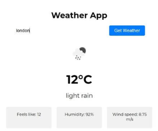

# ☁️ Weather App

## Description
A simple app that fetches and displays weather information based on user location or search.

## Features
- Search weather by city name
- Shows temperature, humidity, wind speed, and weather conditions
- Fetches data from a weather API (e.g., OpenWeatherMap)
- Responsive and clean UI

## Concepts Practiced
- API fetching with async/await
- Handling JSON data
- DOM manipulation
- Error handling and user feedback

## Bonus Challenge
Add weather icons and background changes based on weather conditions.

## Live Demo

  <iframe
    src="https://codesandbox.io/embed/qq8r9n?view=preview&module=%2Findex.html"
    style="width:100%; height:500px; border:0; border-radius:8px; overflow:hidden;"
    title="Weather App"
    allow="accelerometer; ambient-light-sensor; camera; encrypted-media; geolocation; gyroscope; hid; microphone; midi; payment; usb; vr; xr-spatial-tracking"
    sandbox="allow-forms allow-modals allow-popups allow-presentation allow-same-origin allow-scripts"
  ></iframe>

